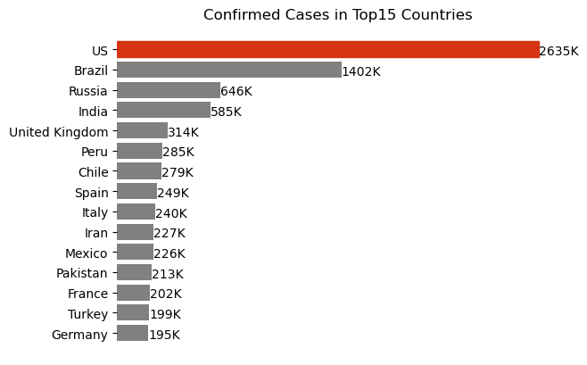
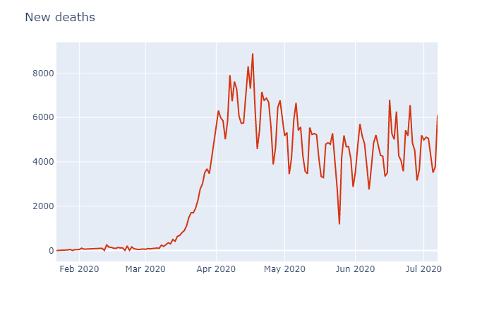
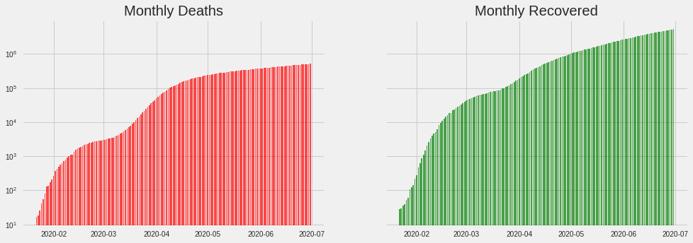
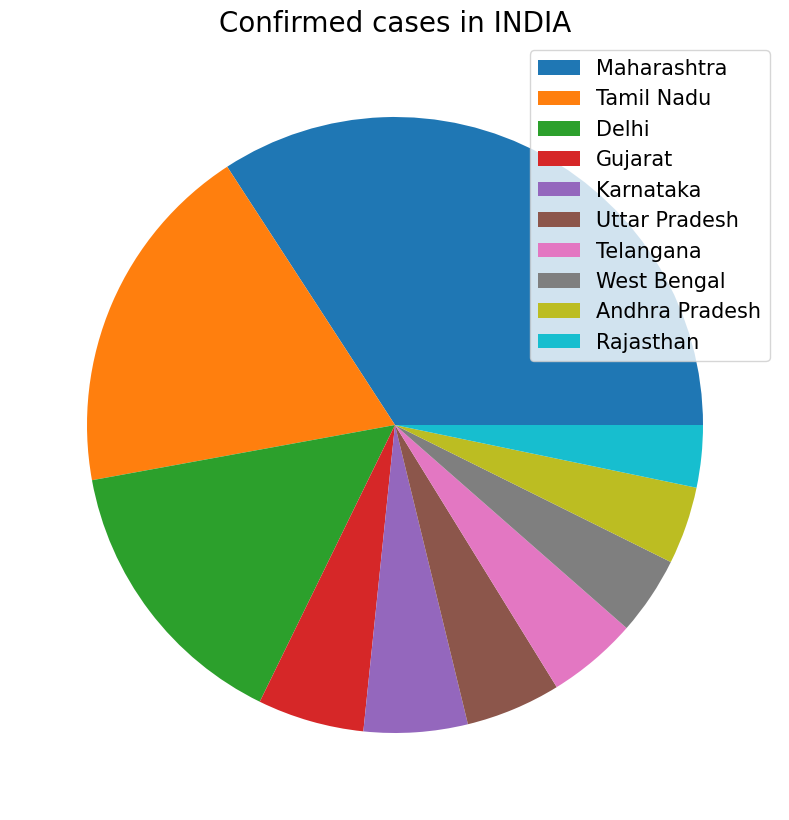
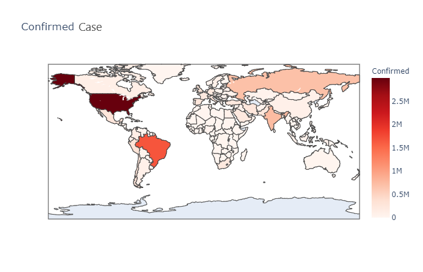

# Covid-19_Analysis
Analysis of covid-19 data using python library pandas, matplotlib, beautiful soap, request, seaborn and plotly(interactive plots). 

# Notification system 
Build-ed a real time notification system that notifies latest updates regarding CORONA virus by Scrapping and cleaning the 
data from "https://www.mohfw.gov.in/" using Beautifulsoup 

# Let me show you some of my plots..

